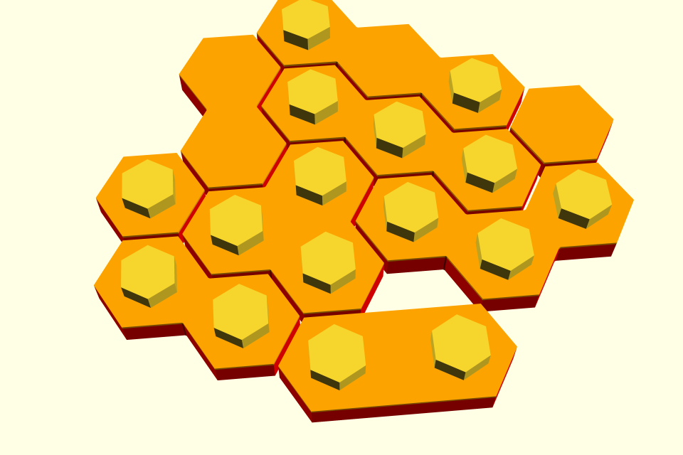

# Interlocking Hexagonal Toy Bricks 

This is an openscad version of [David Barber's Interlocking hexagonal toy bricks](http://tamivox.org/redbear/hex_toy_bricks/index.html),
suitable for fabrication on consumer-grade [FFF/FDM](https://en.wikipedia.org/wiki/Fused_deposition_modeling) 3D printers.
"Released" versions of this project can be found [on thingiverse](http://www.thingiverse.com/thing:2216466).

# License
Dual license.  At your option, you may use this project under the terms of either of these licenses:
* [Creative Commons - Attribution - Share Alike](http://creativecommons.org/licenses/by-sa/3.0/)
* [GNU GPL version 2 or later](https://www.gnu.org/licenses/old-licenses/gpl-2.0.html), including the [GNU GPL version 3](https://www.gnu.org/licenses/gpl.html)
